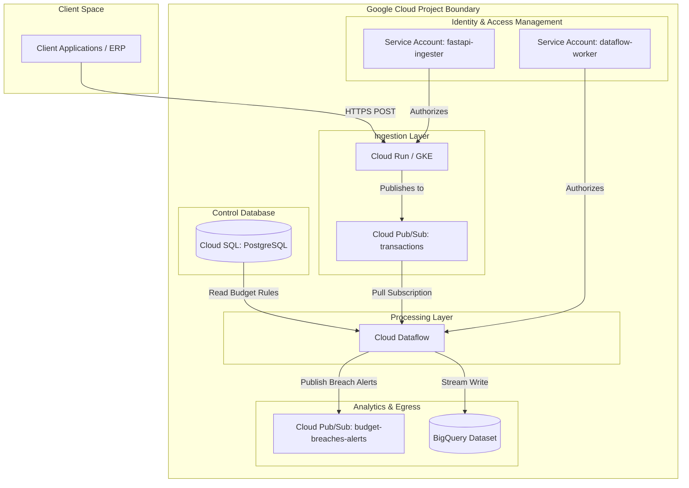

# Production-Grade GCP Infrastructure as Code (Terraform)

This repository contains the **Infrastructure as Code (IaC)** configuration to automate the provisioning, security, and scaling of Google Cloud Platform (GCP) resources for the **Web-Scale FP&A Real-Time Data Pipeline**.

Built using Terraform, this project enforces DevOps best practices, cloud security standards, and cost-optimization principles.

---

## 1. System Architecture

The following diagram illustrates the provisioned services, operational roles, and boundaries within GCP:



---

## 2. Infrastructure Best Practices Implemented

To demonstrate enterprise-grade engineering proficiency, this configuration implements several critical design patterns:

### 📂 Modular Code Structure
Rather than utilizing a monolithic configuration file, the infrastructure is decomposed into single-purpose components:
*   [providers.tf](providers.tf) - Defines Terraform versions and GCP provider configurations.
*   [variables.tf](variables.tf) - Contains input variables decorated with strict HCL **validation blocks**.
*   [services.tf](services.tf) - Controls GCP service enablement dynamically via loops.
*   [pubsub.tf](pubsub.tf) - Configures the message broker (topics/subscriptions).
*   [bigquery.tf](bigquery.tf) - Defines the partitioned and clustered data warehouse tables.
*   [database.tf](database.tf) - Sets up PostgreSQL database instances.
*   [storage.tf](storage.tf) - Handles artifact and temporary Dataflow storage buckets.
*   [iam.tf](iam.tf) - Governs system security, Service Accounts, and least-privilege IAM bindings.
*   [outputs.tf](outputs.tf) - Exposes resource metadata cleanly for downstream consumers.

### 🛡️ Least Privilege Access Control
*   Created isolated, purpose-built Service Accounts for each runtime element (`fastapi-ingester` and `dataflow-worker`).
*   Assigned granular, targeted roles (e.g. `roles/pubsub.publisher` for ingestion, `roles/cloudsql.client` for data processing) rather than broad owner/editor permissions to minimize the security blast radius.

### 💰 BQ Partitioning & Clustering (Cost Optimization)
*   **Partitioning:** BigQuery analytical tables partition events by the hour on the `window_start` column, limiting query scans to targeted time frames.
*   **Clustering:** Structured the tables to cluster on `department_id`, reducing query overhead and optimizing scan operations when compiling reports.

### 🔒 Enterprise Security & Storage Controls
*   **Uniform Bucket Level Access:** Enabled on the GCS bucket (`uniform_bucket_level_access = true`) to enforce consistent IAM policy resolution instead of legacy ACLs.
*   **Secret Management:** Configured the PostgreSQL master password via sensitive variables (`sensitive = true`) to mask values during command line outputs.
*   **Version Pinning:** Enforced strict provider version constraints to safeguard against breaking provider updates.

### 🤖 CI/CD Quality Gates
A GitHub Actions workflow ([terraform.yml](../.github/workflows/terraform.yml)) runs on every Pull Request to:
1.  **Format Check:** Ensures HCL files align with standard styles (`terraform fmt -check`).
2.  **Linting:** Runs static code analysis checks using `tflint` to detect deprecated resources and invalid patterns.
3.  **Semantic Validation:** Executes `terraform validate` in a backend-free run to check variables, structures, and resource models.

---

## 3. Getting Started

### Prerequisites
*   [Terraform CLI](https://developer.hashicorp.com/terraform/install) (>= 1.0.0)
*   [Google Cloud SDK](https://cloud.google.com/sdk/docs/install) (`gcloud` CLI)
*   An active Google Cloud Project

### 1. Authenticate with Google Cloud
Authenticate your local terminal and generate Application Default Credentials (ADC):
```bash
gcloud auth login
gcloud auth application-default login
```

### 2. Configure Variables
Create a file named `terraform.tfvars` inside the `terraform/` directory. This file is local-only and is ignored by Git to protect secrets:

```hcl
project_id  = "your-actual-gcp-project-id"
db_password = "a-secure-master-password-for-postgresql"
region      = "us-central1"
zone        = "us-central1-a"
```

### 3. Deploy Infrastructure

Initialize the directory to download provider plug-ins:
```bash
terraform init
```

Perform a dry run to inspect the planned changes:
```bash
terraform plan
```

Apply the plan to create the resources in GCP (takes ~5-8 minutes due to database provisioning):
```bash
terraform apply
```

To clean up and destroy all cloud resources to avoid billing overhead:
```bash
terraform destroy
```
